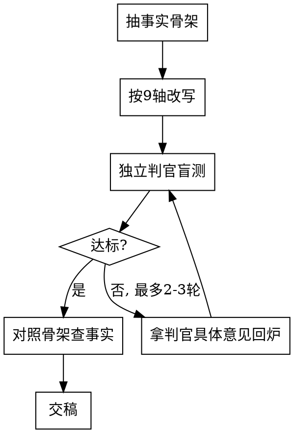

# 蒸馏文风 · Style Fingerprint

## 核心原则

> 风格不是形容词，是指纹。能照着复现的，才叫蒸馏出来了。

裸模型做这件事会犯三个错（已实测）：(1) 风格观察临时拼凑、混入内容立场、不可复用；(2) 改写后没人盲测，自己既当运动员又当裁判，悄悄滑回平庸 AI 腔；(3) 改写时擅自加料删料，把原文事实改没了。这个 skill 用**结构化指纹 + 独立判官盲测 + 事实骨架纪律**钉死这三点。

两个模式：**蒸馏**（样本 → Style Card 文件）和**改写**（目标文章 + Style Card → 改写稿，带盲测闭环）。

## 何时用

- 用户给几篇某作者的文章，想提炼他怎么写
- 用户想把一段话 / 一篇稿 / 一份 AI 生成的文本改成某作者的味儿
- 不适用：用户要的是这个人**怎么思考**（心智模型、世界观、角色扮演）→ 那是 `huashu-nuwa`，不是这里；本 skill 只管**怎么写**。

## 存储（独立库，不进公开 repo）

```
~/code/style-cards/<author-slug>/
  samples/          # 喂进来的原始样本
  style-card.md     # 蒸馏出的 Style Fingerprint（真源，人可读可手改）
  rewrites/         # 历史改写稿（可选）
```
wjs-* skill 会自动同步到公开 repo，所以别人的稿子和卡片放这个独立库，不外泄。库或作者目录不存在就先建。

## Style Fingerprint — 9 轴

每一轴写三件事：**观察**（样本里看到什么）、**可执行规则**（改写时怎么照做）、**锚点原句**（从样本摘 2–3 句真实原句）。规则会骗人，原句不会——没有锚点的轴等于没蒸馏。

| # | 轴 | 抓什么 |
|---|---|---|
| 1 | 句子节奏 | 长短句分布、长短交替的拍子、标点签名（破折号/省略号/问句/感叹） |
| 2 | 段落长度 | 平均段长、有没有单句成段、长段密度 |
| 3 | 词汇 | 高频词、口头禅、自造词、人称、成语/网络语倾向、中英混用、用词雅俗 |
| 4 | 语气腔调 | 自信度、距离感（亲密 vs 客观）、正式度、幽默 |
| 5 | 论证结构 | 断言先行 vs 层层铺垫、是否用小标题/列表/表格、推进路径 |
| 6 | 比喻运用 | 家常 vs 抽象、频率、抽象↔具体之间怎么架梯子 |
| 7 | 情绪强度 | 情绪温度、克制 vs 喷发、感叹密度 |
| 8 | 开头与收尾 | 怎么起（断言/场景/钩子）、怎么落地收束 |
| 9 | 雷区 | 他绝不会做的事（如不用小白提问钩子、不写没验证过的、不用某类书面词） |

模板见 `references/style-card-template.md`，直接照着填。

**别把内容立场写进指纹**：「他爱唱反调」「他三观是 X」是*想法*不是*文风*。指纹只抓「怎么写」——同一个观点换了他来写会长什么样。

**「调料不是公式」校准注（写进每张卡）**：签名动作（造词 / 家常比喻 / 单句成段 / 破折号）是**工具**不是**清单**。短内容就短写，别把每个签名动作都堆满——堆满就是拙劣模仿，不是那个人。

## 蒸馏流程

1. 样本入库 `samples/`。建议 3–6 篇，覆盖不同主题 / 长度。**少于 3 篇要明确提示用户：指纹会不稳、容易把一篇的偶然写法当成签名。**
2. 长样本起一个 subagent 做 9 轴拆解，避免污染主上下文，只回收结构化结果。
3. 逐轴分析，每轴**必须摘锚点原句**。
4. 写出 `style-card.md`（照模板），让用户过目 / 手改。

## 改写流程（带盲测闭环）



1. **抽事实骨架**：先把目标文章的论点 / 信息 / 结论列成几条 bullet。这是「保事实」的锚——改写**不增不减**这些事实，只换怎么说。
2. **按 9 轴改写**：允许调开头 / 收尾 / 节奏 / 小标题 / 段落切分，但事实骨架原样保留。
3. **独立判官盲测（必做，不可跳）**：起一个 subagent，**只给它 Style Card 的锚点 + 改写稿，不给原文、不告诉它这是 AI 改的**。判官 prompt 见 `references/judge-prompt.md`。它输出：逐轴相似度评分（1–5）、具体出戏句列表、缺失/过载的签名动作。
4. **不达标回炉**：默认阈值平均 ≥4/5 且无单轴 ≤2。不过标就拿判官的**具体出戏句**回炉重改，再测，最多 2–3 轮。
   - **判官报「缺某签名动作」≠ 授权加料**。常见的是判官说「缺他招牌的『带数字亲历账』」——如果原文事实骨架里没有这个事实，**绝不能为了凑分替作者编一段**。那一轴宁可拿 4 不拿 5。风格满分和事实纪律冲突时，事实纪律赢。能补的只有「换说法」，不能补「新事实」。
5. **对照骨架查事实**：交稿前比对第 1 步的骨架，有没有篡改 / 丢失 / 新增事实。改写可以换说法，不能换事实。

判官子 agent 是「同一个模型既当运动员又当裁判」的唯一解药。**自己读一遍觉得挺像 ≠ 像**——这正是裸模型滑回平庸的入口。

## 红旗——出现就是要回到正轨

- 「这段我自己看挺像的，不用再起判官了」→ 自评不算数，盲测必做
- 「直接列几条风格特点就开始改」→ 没填 9 轴模板、没摘锚点 = 没蒸馏
- 「原文这句不够味儿，我给它补一句」→ 停，事实骨架不增不减，加料是改内容不是改风格
- 「判官说缺他招牌的某个动作，我加段亲历账/数字凑上去」→ 停，原文没这事实就不能编，那一轴拿 4 也认
- 「把造词、比喻、小标题全用上更像」→ 堆满是拙劣模仿，看调料校准注
- 「样本就两篇，够了」→ 提示用户指纹会不稳

## 常见错误

| 错误 | 后果 | 修正 |
|------|------|------|
| 指纹只有抽象规则，没锚点原句 | 改写时规则空转，套不出味儿 | 每轴强制摘 2–3 句真实原句 |
| 把内容立场当文风 | 改写跑偏成换观点 | 指纹只问「怎么写」 |
| 跳过判官盲测 | 滑回平庸 AI 腔自己不知道 | 判官必做，盲、独立 |
| 改写顺手加料删料 | 原意被改 | 先抽事实骨架，改写不增不减 |
| 签名动作堆满 | 拙劣模仿 | 短内容短写，调料不是公式 |
