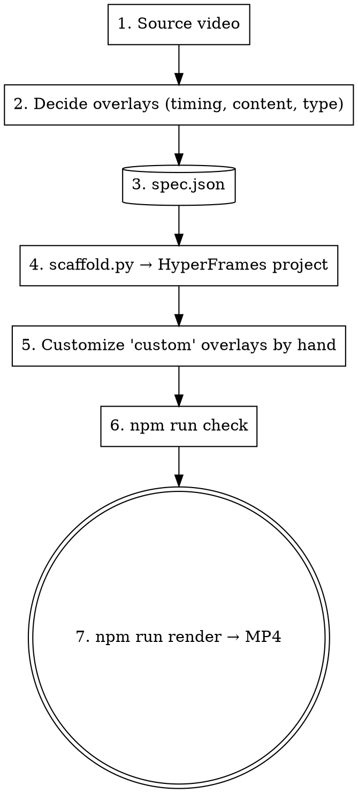

# Video Overlay

## Overview

Layer animated content on top of an existing video. The source video is the base track; one or more **overlays** appear at specific timestamps and disappear at the end of their window. Each overlay is a styled HTML element with a self-contained GSAP entrance and exit animation.

**The skill is a thin convention on top of HyperFrames.** It encodes:
- "video as base track + timed overlay clips" as the canonical pattern
- ~4 reusable overlay archetypes (quote, slogan, callout, custom)
- A JSON-spec → HyperFrames project scaffolder, so 90% of overlays land in one command
- Escape hatch (`type: custom`) for anything bespoke — Claude hand-writes the overlay HTML/CSS/GSAP

The output is a HyperFrames project you can preview, edit, and render exactly like any other HyperFrames composition.

## When to use

- User has a finished video (talk, interview, tutorial, ad cut) and wants to dress it up with motion graphics
- User wants kinetic typography overlays on a clip — opening hook, key-quote callout, closing slogan
- User wants a "documentary cutaway" — a brief full-screen animated demonstration appearing on top of the live footage at a specific moment, then disappearing
- User wants chapter title cards or section dividers that don't replace the audio

**Don't use** for: full HyperFrames productions where the source isn't a fixed video (use `hyperframes` directly), translation/subtitling (use `translate-video`), splitting one video into multiple short clips (use `video-segmentation`), batch cover-image generation (also `video-segmentation`).

## Workflow



## spec.json schema

```json
{
  "source_video": "../path/to/source.mp4",
  "duration": 135.4,
  "size": "1920x1080",
  "name": "clip_01_animated",
  "overlays": [
    {
      "id": "o1",
      "type": "quote",
      "start": 8.0,
      "duration": 6.0,
      "position": "top",
      "lines": ["代码不存在错误", "只存在意图错配"],
      "accent": [false, true]
    },
    {
      "id": "o2",
      "type": "custom",
      "start": 42.0,
      "duration": 18.0,
      "html": "overlays/terminal_demo.html"
    },
    {
      "id": "o3",
      "type": "slogan",
      "start": 122.0,
      "duration": 13.4,
      "position": "bottom",
      "lines": ["改 prompt", "不改 AI 生成的代码"],
      "accent": [false, true]
    }
  ]
}
```

| Field | Required | Notes |
|---|---|---|
| `source_video` | Yes | Path to source MP4 (relative to spec.json or absolute). Symlinked into the project as `source.mp4`. |
| `duration` | Yes | Total composition length in seconds — must match the source video. |
| `size` | No | `WIDTHxHEIGHT` (default `1920x1080`). |
| `name` | No | Project directory name (default: spec.json's parent dir name). |
| `overlays[].id` | Yes | Unique element id (kebab-case or `o1`-style). |
| `overlays[].type` | Yes | `quote`, `slogan`, `callout`, or `custom`. |
| `overlays[].start` | Yes | Start time in seconds. |
| `overlays[].duration` | Yes | How long the overlay is on screen. |

### Overlay types

**`quote`** — full-width kinetic typography, optionally over a top or bottom darkened gradient. 1-2 lines, large bold characters. Best for opening hooks and key-quote callouts that pause the conversation.

| `quote` field | Notes |
|---|---|
| `position` | `top` or `bottom` (default `top`). Where the gradient lives. |
| `lines` | Array of 1-2 strings. Use `\n` if you really need a hard line break inside one string. |
| `accent` | Array of booleans matching `lines`; `true` = render that line in accent yellow. Default: last line accented. |
| `font_size` | Override base font size in px (default 140 for `position: top`, 170 for `position: bottom`). |

**`slogan`** — alias for `quote` with `position: bottom` and slightly larger type. Use this for closing slogans / CTAs at the end of a video. Accepts the same fields as `quote`.

**`callout`** — small annotation panel anchored to a corner of the frame. Doesn't darken the rest. Use for chapter labels, source citations, "as seen in", lower-thirds.

| `callout` field | Notes |
|---|---|
| `anchor` | `top-left`, `top-right`, `bottom-left`, `bottom-right`, `bottom-center` (default `top-right`). |
| `text` | Single string (or 1-2 line array). |
| `subtext` | Optional smaller secondary line. |

**`custom`** — escape hatch. The scaffold inserts a `<div>` clip with the right `data-start`/`data-duration`/`data-track-index`, but the inner HTML, CSS, and GSAP entrance/exit are written by Claude. Use this for terminal demos, layer diagrams, animated charts, anything beyond the 3 archetypes above.

| `custom` field | Notes |
|---|---|
| `html` | Path (relative to project root) to a fragment file containing the overlay's inner HTML. The scaffold inlines its `<style>` and `<script>` blocks into the root composition. |

When you write a `custom` overlay, follow the patterns in `references/custom_overlay_recipes.md`. The fragment file uses three section markers — the scaffolder reads each section and inlines it into the right place in the root composition:

```html
<!-- BEGIN-OVERLAY-HTML -->
<!-- inner HTML for the overlay clip; replaces the {id} div's content -->
<!-- END-OVERLAY-HTML -->

<!-- BEGIN-OVERLAY-CSS -->
/* CSS scoped to #{id}; gets inlined into the root <style> tag */
<!-- END-OVERLAY-CSS -->

<!-- BEGIN-OVERLAY-JS -->
// GSAP tweens on `tl` (root timeline already in scope)
<!-- END-OVERLAY-JS -->
```

CSS and JS sections are optional; HTML is required. Time positions in the JS section must be `>= overlay.start` and `<= overlay.start + overlay.duration` — the framework hides `#{id}` outside that window, so animations outside it are invisible.

## Step-by-step

### Step 1 — Decide the overlays

Watch the source video (or read its SRT). Identify 2-5 moments that benefit from overlay. Don't add an overlay at every cue — overlays should be **rare and high-impact**. A 10-minute video typically supports 3-5 overlays max. Three principles:

- **Open with a hook.** A kinetic-typography quote in the first 8-15 seconds, summarising the key claim of the video.
- **Cutaway when there's something to demonstrate.** If the speaker is describing a concept that has a visual structure (a code example, a layered system, a before/after), show that structure as a `custom` overlay during the relevant 15-30s.
- **Close with a slogan.** A bottom-band slogan in the final 10-15 seconds, distilling the takeaway.

For each overlay, decide: type, start time (seconds, snapped to natural pause/cue boundary), duration, content.

### Step 2 — Write spec.json

Save it next to the source video. Use the schema above. Reference an existing spec from `references/example_spec.json` if helpful.

### Step 3 — Scaffold

```bash
python3 ~/.claude/skills/video-overlay/scripts/scaffold.py spec.json
```

Generates a HyperFrames project at `./<name>/` containing:
- `index.html` — the root composition (video + audio + overlays + GSAP timeline)
- `source.mp4` — symlinked from the path in spec.json
- `package.json`, `hyperframes.json`, `meta.json` — standard HyperFrames scaffolding (via `npx hyperframes init`)
- `overlays/` — only if the spec references custom HTML files; copies them in

If a `custom` overlay's `html` path doesn't exist yet, the scaffold creates a placeholder file with TODOs — you fill it in next.

### Step 4 — Fill in custom overlays (if any)

Open each `overlays/<name>.html` placeholder and write the overlay's HTML + CSS + GSAP entrance/exit. The placeholder includes a working skeleton you adapt. See `references/custom_overlay_recipes.md` for ready-made recipes (terminal demo, layer-stack diagram, callout with arrow, before/after split).

The custom overlay's `<style>` and `<script>` are inlined into the root composition by the scaffold — but this only happens at scaffold time. **If you edit a custom overlay's HTML/CSS/GSAP after scaffolding, re-run the scaffold to refresh the inlined version, OR edit the inlined version directly in `index.html`.** The simpler workflow is to edit `index.html` directly once you've scaffolded.

### Step 5 — Check

```bash
cd <name>
npm run check   # lint + validate + inspect
```

Fix any errors. Contrast warnings on overlays that are out-of-window are common false positives (the validator samples text colors at timestamps when the overlay is hidden) — review them but they typically don't need fixing.

### Step 6 — Render

```bash
npm run render
```

Output lands at `renders/<name>.mp4`. A 2-minute 1080p composition takes ~10 minutes on M-series Mac.

## Quick reference

| Task | Command |
|---|---|
| Scaffold project from spec | `scaffold.py spec.json` |
| Scaffold to specific dir name | `scaffold.py spec.json --out my_project/` |
| Re-scaffold (overwrites index.html) | `scaffold.py spec.json --force` |
| Lint + validate + visual inspect | `cd <name> && npm run check` |
| Preview in browser | `cd <name> && npm run dev` |
| Render to MP4 | `cd <name> && npm run render` |

## Common mistakes

- **Too many overlays.** 3-5 is plenty for most videos. Density above that fatigues viewers and hides the source content.
- **Overlay too long.** A `quote` overlay over 8s starts to feel slow; full-screen `custom` cutaways above 25s start to feel like a different video. Keep them tight.
- **Overlay covers the speaker's face for too long.** When the source is an interview/talk, keep the live face visible for at least the first sentence and last sentence of any overlapping moment. Open with the live face, cut to overlay, return to live face.
- **Editing both `overlays/*.html` AND `index.html` separately.** The scaffold inlines custom overlay sources at scaffold time. Once scaffolded, treat `index.html` as the source of truth and edit there — or re-run scaffold to refresh.
- **Forgetting to update `duration`.** If `duration` in spec.json doesn't match the source video, the renderer either truncates or hangs at the end. Use `ffprobe -v error -show_entries format=duration -of csv=p=0 source.mp4` to get the exact value.
- **Skipping `npm run check`.** The lint catches CSS scoping errors and forgotten `class="clip"` attributes that would otherwise produce broken renders 10 minutes later.

## Integration with other skills

- **`hyperframes`** — the underlying framework. The scaffold produces standard HyperFrames projects; everything in the hyperframes skill applies (preview, render, transitions, audio-reactive, etc.). Read it whenever you write `custom` overlays.
- **`hyperframes-cli`** — the CLI commands the project uses (`init`, `lint`, `validate`, `inspect`, `render`). The scaffold delegates project initialization to `npx hyperframes init`.
- **`gsap`** — patterns for the entrance/exit animations inside custom overlays.
- **`video-segmentation`** — if your source needs to be cut from a longer talk first, use that skill to produce the clip, then apply video-overlay.
- **`translate-video`** — if the source needs subtitles burned in before overlay, do that first; overlays render on top of the burned subtitles.
